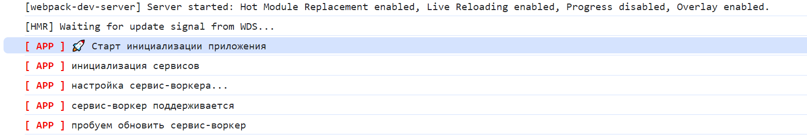

# dev-logger

Version of the service log for development mode.

## Installation

```bash
yarn add @budarin/dev-logger
```

## Usage

```ts
import { DevLogger, LightScheme, SchemaStyles } from '@budarin/dev-logger';

const getStyle = (color: string): string => `color: ${color}; font-weight: bold;`;
const schemasStyles: SchemaStyles = {
    '[APP]': {
        light: getStyle('red'),
        dark: getStyle('blue')
    },
     ...
};


const logger = new DevLogger(schemasStyles);
logger.debug('[APP]', 'Hello world!'); // [APP] Hello world! in browsers light scheme (light or dark)


const darkLogger = new DevLogger(schemasStyles, 'dark');
darkLogger.debug('[APP]', 'Hello world!'); // [APP] Hello world! in dark scheme
```

It looks like this

