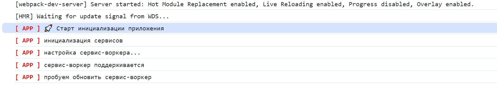

# dev-logger

Version of the service log for development mode.
Allows you to have a color division of logs for `logger.debug`

## Installation

```bash
yarn add @budarin/browser-pino-dev-logger
```

## Usage

```ts
import { PinoDevLogger, LightScheme, SchemaStyles } from '@budarin/browser-pino-dev-logger';

const colorSchema: LightScheme = {
    '[APP]': {
        light: 'blue',
        dark: 'lightblue',
    },
    '[DOMAIN]': {
        light: 'red',
        dark: 'coral',
    },
    '[SERVICE]': {
        light: 'green',
        dark: 'lime',
    },
};

const appLogger = new PinoDevLogger({ layer: '[APP]' }, colorSchema);
appLogger.info('Hello world!'); // [APP] Hello world! in browsers light scheme (light or dark)

const domainLogger = appLogger.child({ layer: '[DOMAIN]' });
domainLogger.info('Hello world!'); // [APP][DOMAIN] Hello world! in browsers light scheme (light or dark)

const darkServiceLogger = new PinoDevLogger({ layer: '[SERVICE]' }, colorSchema, 'dark');
darkServiceLogger.info('Hello world in dark light theme!'); // [SERVICE] Hello world! in dark scheme

const ordinaryLogger = new PinoDevLogger();
ordinaryLogger.info('Hello world in default color fro current light scheme!'); // Hello world! in usual not colored output
```

## Disable/Enable Loggers

You can disable or enable specific loggers or all loggers at once using the global `logger` object in console while debugging:

```ts
// Disable specific logger
logger.disable.APP();        // Disables APP logger
logger.disable.DOMAIN();     // Disables DOMAIN logger
logger.disable.SERVICE(); // Disables SERVICE logger

// Enable specific logger
logger.enable.APP();         // Enables APP logger
logger.enable.DOMAIN();      // Enables DOMAIN logger

// Disable all loggers
logger.disable.all();

// Enable all loggers
logger.enable.all();
```

**Note:** Logger names are automatically cleaned from spaces and brackets. So if you create a logger with `{ layer: '[ APP ]' }`, you can disable it with `logger.disable.APP()`.

It looks like this


